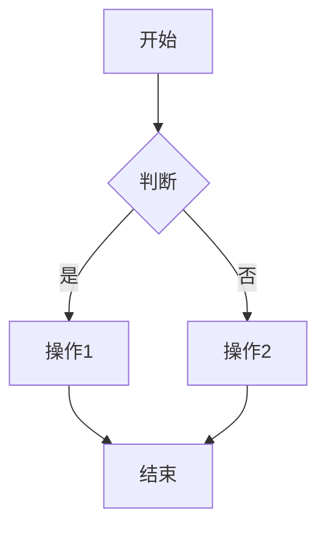

# MermaidBetter

一款现代化的 Mermaid 图表桌面编辑器，支持实时预览。


## 功能特性

- **实时预览**: 编写代码时即时查看图表变化
- **语法高亮**: Monaco 编辑器完整支持 Mermaid 语法
- **多种主题**: 提供 Default、Forest、Neutral、Base 四种主题
- **流程方向**: 支持 TD、LR、BT、RL 四种布局方向
- **缩放平移**: 便捷的图表导航控制
- **导出功能**: 支持导出 PNG 和 SVG 格式
- **深色模式**: 适应不同光线环境的编辑体验
- **可调面板**: 自定义工作区布局

## 界面预览

```
+------------------+------------------+
|                  |                  |
|    代码编辑器      |      预览区       |
|    (Monaco)      |    (Mermaid)     |
|                  |                  |
+------------------+------------------+
```

## 技术栈

- **前端**: React 19, TypeScript, Vite
- **后端**: Rust, Tauri 2.0
- **编辑器**: Monaco Editor
- **图表**: Mermaid.js
- **UI**: Tailwind CSS, Shadcn/UI
- **状态管理**: Zustand

## 快速开始

### 环境要求

- [Node.js](https://nodejs.org/) (v18+)
- [Rust](https://www.rust-lang.org/tools/install)
- [Tauri 环境依赖](https://tauri.app/v2/guides/prerequisites/)

### 安装步骤

```bash
# 克隆仓库
git clone https://github.com/htd-1/mermaidbetter.git
cd mermaidbetter

# 安装依赖
npm install

# 开发模式运行
npm run tauri dev
```

### 生产构建

```bash
npm run tauri build
```

构建产物位于 `src-tauri/target/release/` 目录。

## 使用说明

1. 在左侧面板编写 Mermaid 代码
2. 右侧面板实时显示渲染结果
3. 使用顶部工具栏：
   - 切换图表主题
   - 调整流程方向
   - 切换深色/浅色模式
   - 导出为 PNG 或 SVG

### 示例代码



## 快捷键

| 操作 | 快捷键 |
|------|--------|
| 放大 | `Ctrl + 滚轮上` |
| 缩小 | `Ctrl + 滚轮下` |
| 重置视图 | 点击重置按钮 |

## 项目结构

```
src/
├── components/
│   ├── layout/        # Header, MainLayout
│   ├── editor/        # CodeEditor
│   ├── preview/       # MermaidRenderer, PreviewControls
│   └── ui/            # Shadcn 组件
├── store/             # Zustand 状态管理
├── lib/               # 工具函数、Mermaid 配置
└── hooks/             # 自定义 React Hooks
```

## 参与贡献

欢迎提交 Pull Request！

1. Fork 本项目
2. 创建特性分支 (`git checkout -b feature/AmazingFeature`)
3. 提交更改 (`git commit -m 'Add some AmazingFeature'`)
4. 推送到分支 (`git push origin feature/AmazingFeature`)
5. 发起 Pull Request

## 开源许可

本项目基于 MIT 许可证开源 - 详见 [LICENSE](LICENSE) 文件。

## 致谢

- [Mermaid.js](https://mermaid.js.org/) - 图表渲染引擎
- [Tauri](https://tauri.app/) - 桌面应用框架
- [Monaco Editor](https://microsoft.github.io/monaco-editor/) - 代码编辑器
- [Shadcn/UI](https://ui.shadcn.com/) - UI 组件库
